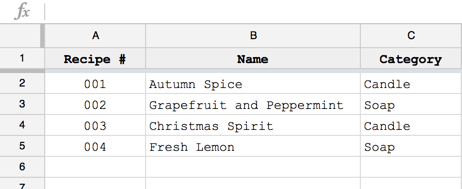
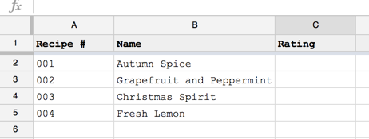

Tonight I was working on a spreadsheet in Google Sheets and had the need to do some advanced formatting on cells referencing data across multiple sheets. It took me a while to get it exactly how I wanted it, and I wanted to post this to hopefully help anyone who has tried to do something similar and struggled.

## The Situation

My wife and I were making some soy wax candles and some hand soaps using essential oils (it's actually insanely cheap to make your own stuff, <a href="mailto:{{site.data.settings.email}}">email me</a> if you want more info). We wanted to keep track of "recipes" (each time we try one) and if we like it, we'll make it again. We could make notes or adjust it to try and improve it, but that would be a new recipe. One sheet, called "Recipes", has a column for "Recipe #" as the first and "Name" as the second. Here's a screenshot:



The second sheet, "Ratings", pulls in the values of the first two columns, then has a third column called "Rating". This way the first two columns automatically get populated when we add a new recipe. The third column, "Rating" can stay blank and nothing will happen. If the value of the cell in the Rating column is "Good", the corresponding "Recipe #" cell on the first sheet will have a green background color, and if it's "Bad", it will have a red background color. Here's a look at the second sheet without any ratings:



Google Sheets has some good stuff baked in as far as the conditional formatting of cells goes, but some of the advanced stuff you can do is not well documented. In this instance, I didn't want to create conditional formatting individually - I wanted to specify a range and have that formatting apply to the corresponding cell on the other sheet, which was surprisingly difficult to find documentation for (StackOverflow ultimately got me close enough that I was able to piece a few things together and make it work). We are looking for three things:

1. Able to apply the formatting to a range of cells (in this case, `A2:A1000`) in the Recipe sheet
2. Able to reference the Ratings sheet
3. Have the rating apply highlighting only to the one cell

Item 1 is easy - you can specify a range in conditional formatting, no problem. To get items 2 and 3, we have to select "Custom formula is" for the "Format cells if..." dropdown. It then gives you an input field to enter your custom formula, which takes a value that looks like this: `=B2>0.75*C2` or `=A2="Hello"`. So at this point, we are applying the formula in this field to the entire range of cells `A2:A1000`. In order to reference another sheet in this formula, you have to use a function in Sheets called `indirect`, which looks like this:

```javascript
indirect("Sheet!cell")
```

So we now have two questions (at least I did at this point in the process of figuring it out): what are the cells I need to target in the indirect function, and what is the "equal" value in the custom formula field. Here's how it all ended up coming together:

```javascript
=lower(indirect("Ratings!$C:$C"))="good"
```

I wrote that rule and another one exactly the same except with "bad" instead of "good" and had them highlight the cells red and green. Note that I also wrapped the value in a `lower()` function to ensure I could put "Good", "GOOD", or "good" and they'd all mean the same thing. Here's the final result:


> Note: the grapefruit + peppermint isn't actually bad, I just wanted to show both colors highlighting. It's actually quite a refreshing scent!

And the conditional formatting setup:


I hope this was helpful! Cheers!
