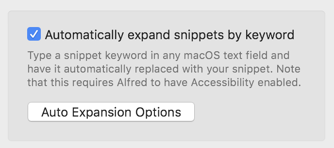
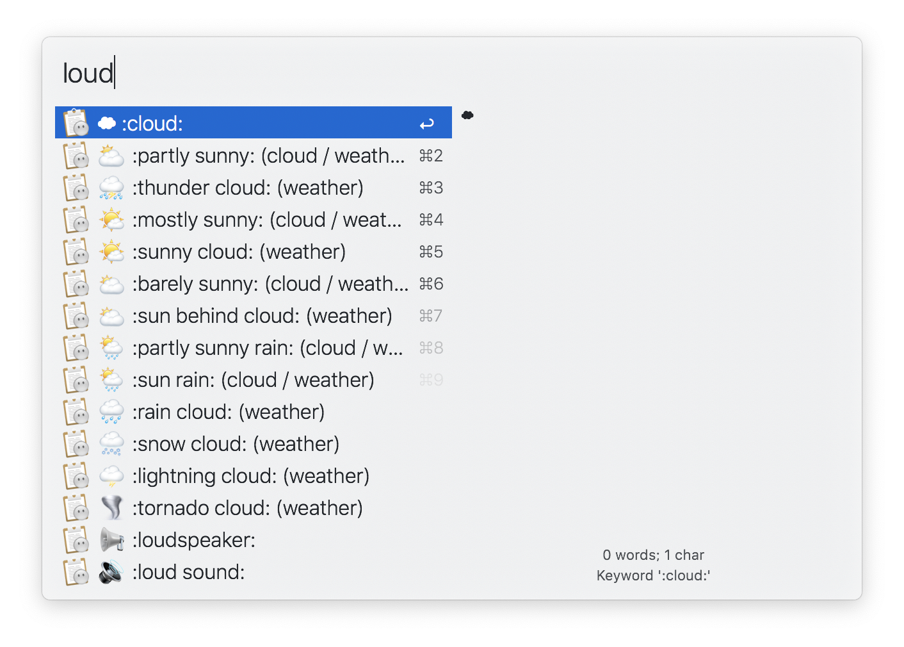

[Alfred](https://alfredapp.com) is a powerful application with vast capabilities for automation. In this post we'll explore how to make it dead simple to use it as a system-wide emoji picker in macOS. Fair warning here, if you do not already use Alfred, it is not a free app if you want to install custom things like what we'll do here, but anyone who uses it will tell you that it is well worth the price to pay for the powerpack.

<h2 class="font-medium mt-8 mb-4 text-2xl">The Problem</h3>

Applications like Slack and even web applications like GitHub have implemented a seamless experience for inserting emoji into text. You start typing `:` and the emoji picker pops up. You can then start typing a name of an emoji and when you find the one you want, press `return` and it will insert the emoji inline in your text. It's a wonderful UX that I wish were available in every application. macOS has implemented a native one, but it is horrible. The global shortcut is clunky and hard to remember, the picker takes a VERY long time to load, and searching emoji is not great (you can't type to filter... you just scroll... FOREVER). I've tried a number of third party Mac apps that aim to do this, and while I did find a few that were very good, ultimately I landed on Alfred snippets as a solution.

<h2 class="font-medium mt-8 mb-4 text-2xl">The Competition</h3>

If you're interested in checking out some of the other solutions, I've tried a few and would recommend checking out the following:

- [mojibar](https://github.com/muan/mojibar) by Muan. This is an Electron app that also lives in the menubar and is the first one I used. It allows you to customize the global hotkey which I loved, and the UI on it is quite nice. What I didn't like about it is that when you selected an emoji, the app would copy the character to your clipboard and then close. You then had to switch back to the previous app you were in and paste the emoji that was copied. I knew there should be a better solution. I switched from this to qmoji.
- [qmoji](https://github.com/jaredly/qmoji) by Jared Forsyth. This app lives in the menubar and can be triggered by clicking the icon or by using a global hotkey. I used this for a LONG time and it's very well done. You type the hotkey and you are automatically focused into the menubar app. Start searching for an emoji. You can tab through and when you press `return` it will paste that emoji into the previous app you were in. It's super well done. Unfortunately you couldn't customize the global hotkey and I frequently would have trouble remembering what it was, so I switched to Rocket.
- [Rocket](https://matthewpalmer.net/rocket/) by Matthew Palmer. Automatically triggers when you type `:`. You can disable it in certain apps and even on certain websites (but only if you use Safari or Chrome), but I found that it triggered when I wouldn't want. For instance, if I were typing "Meet me at 4:30", it would trigger on the colon inside the time, when more than likely I only want it when the colon starts a new word. Of the apps I tried, Rocket was by far the most polished. I gladly paid the $5 for the full version.

There are certainly other apps that aim to do this but many of them were very basic and not customizable, or just didn't work well.

<h2 class="font-medium mt-8 mb-4 text-2xl">Alfred To The Rescue</h3>

I finally made the jump to Alfred sometime in 2019 in an effort to try and bake a little more automation into my everyday workflow and speed up some repetitive tasks. I came across the [Alfred Emoji Pack](http://joelcalifa.com/blog/alfred-emoji-snippet-pack/) by Joel Califa and saw a lot of promise in it, so I installed it and promptly forgot about it until recently. After tinkering around with a few settings, I was able to take all the things I loved about each of the apps above and make it into a seamless system-wide flow for picking emoji. We'll walk through it step by step here.

First thing you'll have to do is download and install the pack from the link above. Instructions are on the website so I won't go through that here. What it will do is install a bunch of snippets in Alfred, which can be used anywhere.

<h3 class="font-medium mt-8 text-xl">Auto Expansion</h3>

In order for snippets to auto-expand in any application, you need to enable this setting:

That gets you part of the way there - if you know the keyword for your emoji, you can type `:keyword:` in any app and it will auto-expand, no extra work required.

Cool... but what if you don't know the name of the emoji EXACTLY?

<h3 class="font-medium mt-8 text-xl">Snippet Search</h3>

You have two other options for searching through your snippets. The first is to open Alfred and type your snippet keyword (defined in that same settings page), then start typing your snippet name:

The other option for searching through snippets is to enable a global hotkey:

A few things to note about these settings:

- Make sure you set your viewer hotkey if you want a global hotkey. Click into the field and then press your desirerd key combo. I like `cmd` + `;` because that's what I used on Mojibar and it was very natural since the semicolon is the same key used to trigger it in apps like Slack and GitHub, except using `cmd` instead of `shift`. I also found that it's not a key combo that is used very often as a shortcut so I'm not overriding things.
- You'll want to make sure "Word based" is NOT checked. I found myself wanting to trigger the shortcut and start typing the emoji name. When it's a single word, the snippet search sees the `:` as part of the word, and so searching "whiskey" would return no results. Unchecking "Word based" makes it act more like a fuzzy search.

Here's what that looks like:

In either of the two approaches to searching snippets, Alfred will automatically paste the snippet into the underlying application.

<h3 class="font-medium mt-8 text-xl">Aliases</h3>

That's all great, but sometimes I don't remember a keyword for an emoji and it drives me nuts trying to remember. It would be sweet if I could add an alias. Rocket allows you to add custom keywords and map that to an emoji. In Alfred, all we have to do is go into our snippets and add a new one. You'll want to follow the convention in the Emoji Pack, where the Name of the snippet is the emoji plus the keyword. This helps when searching to see which emoji you'll be picking.

<h2 class="font-medium mt-8 mb-4 text-2xl">Recap</h3>

By using the Alfred Emoji Pack and tweaking a few of our Alfred snippet settings, we get all the best functionality of some various applications. We get:

- a customizable global hotkey for triggering an emoji search, like in mojibar
- really good search, as well as aliases, like Rocket
- paste the selected emoji into the underlying application, like qmoji or Rocket
- auto-expansion (no other Mac emoji apps do this, but apps like Slack and GitHub do it)

Hopefully this was helpful! I love productivity hacks and automating stuff, so if you have any other great Alfred workflows you want to share I'd love to hear them. <a href="https://twitter.com/_mcbridem_" target="_blank" rel="nofollow noreferrer">Hit me up on Twitter</a>!